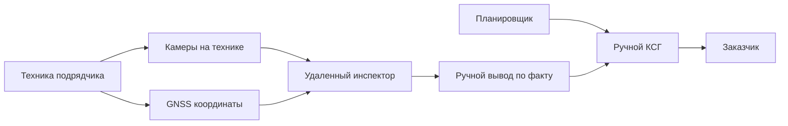

# 01. Описание системы

> Сокращения и рабочие термины расшифрованы в [словаре терминов](13-термины-и-сокращения.md).

## Назначение

`АКСГ` - система для ручного ведения [контрольно-сетевого графика](13-термины-и-сокращения.md) и удаленного контроля процесса строительства железнодорожной инфраструктуры. Она помогает заказчику видеть план работ, фактическое состояние стройки и подтверждающие материалы: фото/видео с камер на технике, координаты GNSS и записи инспектора.

Главная проблема: сейчас КСГ и графики часто собираются вручную по факту стройки, сроки и зависимости находятся в голове ответственного, а объективные данные о работе подрядчика разрознены. Это создает информационный вакуум: хорошо или плохо идет стройка зачастую знает только один человек, который ее ведет.

## Целевые пользователи

| Пользователь | Потребность |
|---|---|
| Заказчик строительства | Видеть объективную картину исполнения объекта, риски сроков и стоимости |
| Инспектор строительного контроля | Удаленно проверять камеры на технике, подтверждать факт работ и фиксировать нарушения |
| Планировщик КСГ | Создавать и вручную вести график, вносить сроки, объемы, статусы и пикетаж |
| Руководитель со стороны генподрядчика | Видеть замечания заказчика, подтверждать ход работ и разбирать отклонения |
| Сметчик | Работать с объемами, стоимостью и связью КСГ со сметой в будущих версиях |
| Администратор платформы | Управлять пользователями, техникой, камерами, проектами и правами доступа |

## Основные сценарии MVP

- Планировщик вручную создает КСГ: заводит работы, сроки, объемы, зависимости, ответственных и обязательную для линейных работ привязку к пикету/диапазону пикетов.
- На технику подрядчика устанавливаются GNSS-модуль и камеры.
- Техника передает координаты, а камеры передают фото/видео в систему удаленного инспектирования.
- Удаленный инспектор подключается к камерам, смотрит состояние работ и фиксирует вывод: подтверждено, требуется проверка, есть отклонение.
- Планировщик или инспектор вручную корректирует КСГ по результатам удаленного контроля.
- Заказчик видит КСГ, журнал проверок, подтверждающие материалы и прозрачную картину хода стройки.

TBD для следующих итераций: импорт графика и смет из Excel, автоматический разбор [ПСД](13-термины-и-сокращения.md)/[ПОС](13-термины-и-сокращения.md)/[ППР](13-термины-и-сокращения.md), автоматический пересчет план-факт, ML-анализ камер и связь с [BIM](13-термины-и-сокращения.md).

## Границы MVP

В MVP входит:

- web-платформа для ручного создания и ведения КСГ;
- карточки работ с датами, объемами, статусами, ответственными и привязкой к пикету/диапазону пикетов;
- система "Удаленный инспектор" для просмотра камер, установленных на технике;
- учет техники, GNSS-координат и камер;
- фото/видео как подтверждающие материалы;
- ручное подтверждение факта и ручная корректировка КСГ;
- журнал проверок, замечаний и изменений графика;
- базовые отчеты для заказчика по статусам работ и замечаниям.

В MVP не входит:

- импорт данных из Excel-графиков, смет и ведомостей объемов работ;
- автоматическое обновление КСГ по факту, телеметрии или камерам;
- надежное ML-распознавание завершенности работ по камерам;
- обязательный БПЛА/лидар-контур;
- автоматическое формирование полного КСГ из BIM или проектной документации;
- полный цифровой паспорт материалов с RFID/GNSS для всех поставок;
- автоматическая интеграция со всеми корпоративными системами РЖД.

## Критерии успеха MVP

| Критерий | Как проверить |
|---|---|
| Планировщик может вручную завести и вести КСГ с пикетажем | Создать проект, работы, сроки, статусы, объемы и привязку к пикету/диапазону пикетов |
| Инспектор может удаленно проверить стройку | Открыть камеру техники, создать запись проверки и приложить вывод |
| Техника дает объективные координаты | В карточке техники видны GNSS-точки и время получения |
| КСГ правится человеком по результатам проверки | После записи удаленного инспектора пользователь вручную меняет статус работы |
| Заказчик видит прозрачность стройки | Дашборд показывает КСГ, замечания, материалы проверки и историю изменений |
| Система снижает трудозатраты инспекторов | Часть проверок выполняется удаленно без выезда на объект |

## Что хочет получить заказчик

1. Сократить трудозатраты инспекторов за счет удаленного просмотра камер на технике.
2. Уменьшить время на работу с документацией: КСГ, сметами, ведомостями и связанными материалами.
3. Увеличить прозрачность управления стройкой, чтобы состояние объекта было видно не только одному ответственному человеку.

## Схема ценности

## Допущения

- Первый объект пилота относится к железнодорожному строительству, поэтому пикетаж является обязательной координатой КСГ для линейных работ.
- Проработка того, как именно удобно привязывать работы КСГ к пикетам и визуализировать эту связь, является отдельной задачей проектирования.
- В MVP КСГ создается и ведется человеком, без обязательного автоматического анализа документов.
- Камеры и GNSS устанавливаются на технику подрядчиков как часть решения АКСГ.
- Автоматический план-факт и компьютерное зрение требуют отдельного исследования и не входят в MVP.
