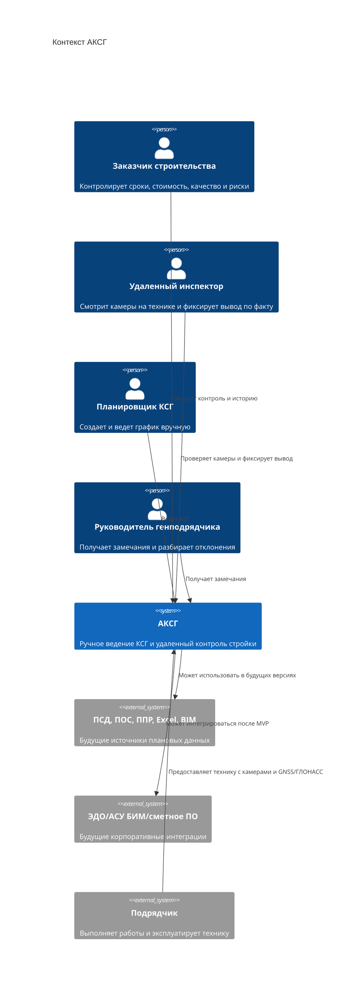

# 02. Контекст и границы

> Сокращения и рабочие термины расшифрованы в [словаре терминов](13-термины-и-сокращения.md).

## Цель

Раздел показывает АКСГ в окружении: кто использует систему, какие компоненты входят в нашу зону ответственности, какие внешние источники важны для будущего развития и где проходит граница MVP.

## Граница системы

Внутри АКСГ находятся web-платформа, ручное ведение КСГ, система удаленного инспектирования, учет техники, GNSS/ГЛОНАСС-модули, камеры на технике, хранилище фото/видео, журнал проверок и управление доступом.

Внешними остаются исходные документы и корпоративные системы: [ПСД](13-термины-и-сокращения.md), [ПОС](13-термины-и-сокращения.md), [ППР](13-термины-и-сокращения.md), сметное ПО, Excel-файлы, [BIM](13-термины-и-сокращения.md)/АСУ БИМ, ЭДО и системы подрядчиков. БПЛА, лидар, RFID/GPS-материалы и глубокие IoT-интеграции рассматриваются как future scope.

## C4 Context

## Входы и выходы

| Поток | Направление | Назначение |
|---|---|---|
| Ручной ввод КСГ | Планировщик -> АКСГ | Создание работ, сроков, объемов, статусов и пикетажа |
| Видео/фото с камер техники | Камеры АКСГ -> Удаленный инспектор | Удаленная проверка состояния работ |
| Координаты техники | GNSS/ГЛОНАСС АКСГ -> АКСГ | Понимание, где была техника и когда получен сигнал |
| Запись проверки | Удаленный инспектор -> АКСГ | Вывод по факту, замечание, ссылка на фото/видео |
| Корректировка КСГ | Планировщик/инспектор -> АКСГ | Ручное изменение статуса или сроков работы |
| КСГ и журнал контроля | АКСГ -> Заказчик | Прозрачная картина хода стройки |
| ПСД/ПОС/ППР/BIM/Excel | Внешние источники -> АКСГ | TBD: автоматизация создания графика в будущих версиях |

## Внутри MVP

- Web Client для заказчика, планировщика, удаленного инспектора и генподрядчика.
- Manual Schedule Service для ручного ведения КСГ.
- Remote Inspection Service для просмотра камер и фиксации выводов.
- Equipment & Camera Service для учета техники, камер и GNSS/ГЛОНАСС-модулей.
- API Gateway/Auth.
- Object Storage для фото/видео и вложений.
- PostgreSQL для КСГ, проверок, пользователей, техники и журнала изменений.

## Вне MVP

- Импорт Excel-графиков, смет и ведомостей объемов работ.
- Автоматический разбор ПСД, ПОС, ППР и BIM.
- Автоматическое обновление КСГ по камерам, GNSS/ГЛОНАСС или телеметрии.
- Обученное ML-распознавание степени готовности по камерам.
- Полный контур БПЛА/лидар с автоматическим расчетом объемов.
- RFID/GPS-паспортизация всех материалов.
- Глубокая интеграция с ЭДО ОАО "РЖД", АСУ БИМ и сметным ПО.

## Открытые вопросы

- Камеры должны отдавать live stream, периодические фото или оба варианта.
- Какие требования к хранению видео: срок, качество, частота кадров, объем.
- Кто имеет право вручную менять КСГ после удаленной проверки.
- Нужна ли отдельная роль удаленного инспектора или ее совмещает планировщик.
- Какой уровень точности GNSS/ГЛОНАСС достаточен: 2 м, 1 м или RTK-сантиметры для отдельных работ.
- Какие документы и интеграции переносить из TBD в следующую версию после MVP.
