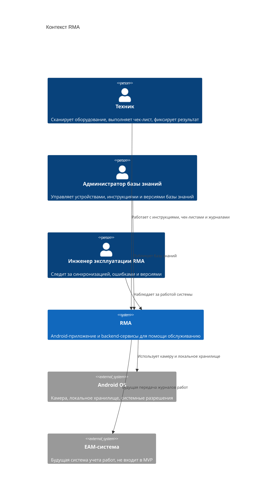

# 02. Контекст и границы

## Цель

Раздел показывает RMA в окружении: кто использует систему, какие внешние зависимости важны для MVP, какие интеграции оставлены на будущее и где проходит граница ответственности.

## Граница системы

Внутри RMA находятся Android-приложение, backend-сервисы, Admin Panel, хранилища, синхронизация базы знаний и журналов. Внешними остаются Android OS, корпоративная инфраструктура развертывания и будущая EAM-система.

EAM-система показана как future scope: MVP готовит `OperationLog` и синхронизационную модель, но не зависит от доступности EAM.

## C4 Context

## Входы и выходы

| Поток | Направление | Назначение |
|---|---|---|
| Фото шильдика | Техник -> Android Client | Локальное извлечение маркировки и определение оборудования |
| Текст проблемы | Техник -> Android Client | Локальный поиск или онлайн-RAG |
| Голосовое описание | Техник -> Speech Service | Онлайн STT, если сеть доступна |
| Версия базы знаний | Backend -> Android Client | Обновление полной локальной базы знаний |
| Журнал действий | Android Client -> Operation Log/Sync Service | Синхронизация выполненных операций |
| Инструкции и чек-листы | Admin Panel -> Documentation Service | Наполнение и публикация базы знаний |

## Внутри MVP

- Android Client.
- API Gateway/Auth.
- Documentation Service.
- Knowledge Sync Service.
- Search/RAG Service.
- Speech Service.
- Operation Log/Sync Service.
- Admin Panel.
- База знаний, журнал операций, объектное хранилище вложений, индекс поиска.

## Вне MVP

- AR-очки.
- EAM-интеграция как обязательный runtime-поток.
- Автоматическое назначение ремонтных задач.
- Поддержка iOS.
- Полностью офлайн-LLM, STT и TTS.

## Открытые вопросы

- Нужна ли интеграция с корпоративным SSO в первой промышленной версии.
- Какая максимальная ожидаемая версия базы знаний должна помещаться на устройстве.
- Какие типы вложений к операциям разрешены в MVP: фото, видео или только фото.
