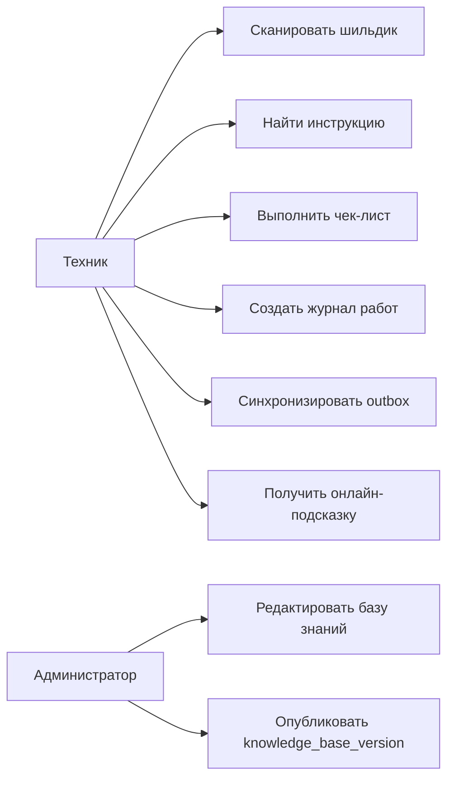

# 03. Требования

## Функциональные требования

| Код | Требование | Приоритет | Как проверить |
|---|---|---|---|
| FR-001 | Android Client должен распознавать шильдик локальным OCR и извлекать признаки оборудования | Must | Демонстрация на тестовых изображениях шильдиков |
| FR-002 | Android Client должен находить устройство в локальной базе знаний по извлеченным признакам | Must | Интеграционный тест локального поиска |
| FR-003 | Android Client должен хранить полную базу знаний локально | Must | Проверка работы поиска без сети |
| FR-004 | Техник должен просматривать инструкции и чек-листы без сети | Must | E2E-сценарий offline |
| FR-005 | Техник должен создавать `MaintenanceJob` и `OperationLog` локально | Must | E2E-сценарий выполнения чек-листа |
| FR-006 | Android Client должен синхронизировать локальный outbox при появлении сети | Must | Интеграционный тест повторной синхронизации |
| FR-007 | Backend должен публиковать полную или инкрементальную версию базы знаний | Must | Contract test API обновления |
| FR-008 | Администратор должен управлять устройствами, инструкциями, чек-листами и версиями базы знаний | Must | Сценарий через Admin Panel |
| FR-009 | При наличии сети техник может использовать RAG-помощь по базе знаний | Should | Интеграционный тест Search/RAG Service |
| FR-010 | При наличии сети техник может использовать STT/TTS для голосового ввода и подсказок | Should | Интеграционный тест Speech Service |
| FR-011 | Система должна поддерживать ручной текстовый ввод как fallback при отказе Speech Service | Must | E2E-сценарий отказа Speech Service |
| FR-012 | Система должна сохранять вложения к операции, если они разрешены политикой MVP | Should | Интеграционный тест загрузки и синхронизации вложений |

## Нефункциональные требования

| Код | Требование | Приоритет | Как проверить |
|---|---|---|---|
| NFR-001 | Офлайн-сценарий локального OCR, поиска, чек-листа и журнала должен работать без доступа к backend | Must | Демонстрация с отключенной сетью |
| NFR-002 | Повторная синхронизация outbox не должна создавать дубликаты `OperationLog` | Must | Failure test с повторной отправкой |
| NFR-003 | Клиент должен явно показывать, что RAG/STT/TTS недоступны без сети | Should | UI/E2E-проверка деградации |
| NFR-004 | Backend-сервисы должны логировать `correlation_id`, `client_operation_id`, `operation_event_id` | Must | Проверка структурных логов |
| NFR-005 | Доступ к операциям техника должен проверяться по роли и владельцу данных | Must | Security integration tests |
| NFR-006 | Новая версия базы знаний не должна ломать уже начатую локальную операцию | Must | Тест совместимости `instruction_version` |
| NFR-007 | Валидация внешних входов обязательна: фото, текст, голос, файлы, admin payload | Must | Unit и integration tests валидации |
| NFR-008 | Серверные сервисы должны поддерживать независимое масштабирование тяжелых AI-функций | Should | Архитектурное ревью и нагрузочные проверки |

## Продуктовые правила

| Правило | Значение | Где применяется | Как проверить |
|---|---|---|---|
| Целевая платформа MVP | Android-смартфоны и Android-планшеты | Android Client, deployment, тесты | Проверка документации и acceptance tests |
| AR-очки | Не входят в MVP | Описание, архитектура, риски | Проверка отсутствия обязательных зависимостей |
| Локальная база знаний | Кэшируется целиком | Android Client, Knowledge Sync Service | Offline E2E |
| AI-функции | Только онлайн | Search/RAG Service, Speech Service | Сценарий отказа сети |
| EAM | Future scope | Риски, ADR | Проверка, что EAM не входит в MVP deployment |
| Идемпотентность журнала | По `idempotency_key` и `operation_event_id` | Operation Log/Sync Service | Повторная синхронизация |

## Use-case обзор

## Ошибочные и альтернативные сценарии

| Сценарий | Ожидаемое поведение |
|---|---|
| OCR не распознал шильдик | Техник вводит модель или серийный номер вручную |
| Устройство не найдено в базе знаний | Создается локальная запись об ошибке поиска; техник может выбрать инструкцию вручную |
| Нет сети | Работают локальный OCR, локальная база знаний, чек-листы и журнал; RAG/STT/TTS недоступны |
| Search/RAG Service недоступен | Приложение использует локальный поиск и ручной ввод |
| Speech Service недоступен | Приложение использует текстовый ввод |
| Синхронизация outbox повторилась | Operation Log/Sync Service применяет событие один раз |
| База знаний обновилась во время операции | Текущая операция продолжает ссылаться на `instruction_version`, с которой была начата |

## Открытые вопросы

- Нужно ли хранить видео-вложения в MVP или ограничиться фото.
- Какие требования к объему локальной базы знаний и частоте обновления.
- Нужны ли разные уровни квалификации техника для фильтрации инструкций.
