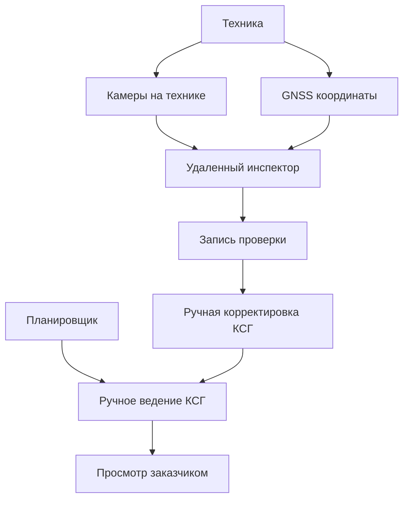

# 03. Требования

> Сокращения и рабочие термины расшифрованы в [словаре терминов](13-термины-и-сокращения.md).

## Функциональные требования

| Код | Требование | Приоритет | Как проверить |
|---|---|---|---|
| FR-001 | Пользователь должен вручную создавать проект строительства | Must | Создать проект и открыть его КСГ |
| FR-002 | Планировщик должен вручную создавать и редактировать работы КСГ | Must | Создать работу, срок, объем, статус, ответственного |
| FR-003 | Работа КСГ должна хранить сроки, объем, статус, ответственного и пикетаж | Must | Проверка карточки работы |
| FR-004 | Система должна хранить историю ручных изменений КСГ | Must | Изменить статус и увидеть запись в журнале |
| FR-005 | Система должна учитывать технику подрядчика с GNSS-модулем и камерами | Must | Создать карточку техники и привязать камеры |
| FR-006 | Система должна принимать координаты GNSS от техники | Must | Интеграционный тест координат |
| FR-007 | Система должна принимать фото/видео с камер, установленных на технике | Must | Загрузить кадр/поток и открыть в интерфейсе удаленного инспектора |
| FR-008 | Удаленный инспектор должен просматривать материалы с камер и создавать запись проверки | Must | Сценарий удаленной проверки |
| FR-009 | Инспектор или планировщик должен вручную корректировать КСГ по итогам проверки | Must | Проверка ручного изменения работы после записи инспектора |
| FR-010 | Заказчик должен видеть КСГ, журнал проверок и подтверждающие материалы | Must | UI-сценарий просмотра проекта |
| FR-011 | Система должна показывать базовые фильтры по статусам, пикетажу и ответственным | Should | UI-сценарий фильтрации КСГ |
| FR-012 | Система должна иметь место для будущего импорта документов, но не требовать его в MVP | Should | В документации и архитектуре импорт помечен как TBD/future |

## Нефункциональные требования

| Код | Требование | Приоритет | Как проверить |
|---|---|---|---|
| NFR-001 | Ручное изменение КСГ должно быть трассируемым до пользователя и времени | Must | Проверка audit trail |
| NFR-002 | Запись удаленного инспектора должна быть идемпотентной по `client_event_id` | Must | Повторная отправка не создает дубль |
| NFR-003 | Фото/видео и координаты должны храниться с контролем доступа по проекту | Must | Security integration tests |
| NFR-004 | Камера или GNSS-устройство не должны иметь прав менять КСГ напрямую | Must | Проверка прав интеграционного устройства |
| NFR-005 | Пользователь должен понимать, что изменение КСГ выполняется вручную | Must | UX-проверка сценария корректировки |
| NFR-006 | Система должна выдерживать поток фото/координат от техники пилотного объекта | Should | Нагрузочный тест ingestion API |
| NFR-007 | Интерфейс удаленного инспектора должен позволять быстро найти технику и связанную работу | Should | UX-проверка |
| NFR-008 | Данные по разным проектам должны быть изолированы | Must | Проверка project isolation |

## Продуктовые правила

- КСГ в MVP создается и ведется человеком.
- Камеры и GNSS помогают удаленно проверить стройку, но не обновляют КСГ автоматически.
- Работа считается измененной только после ручного действия пользователя с соответствующими правами.
- Пикетаж является обязательной координатой для железнодорожных работ, если работа физически привязана к участку пути.
- Импорт Excel, ПСД, ПОС, ППР, сметы и BIM относится к будущим версиям, если не будет отдельно включен в MVP.

## Use-case обзор

## Ошибочные и альтернативные сценарии

| Сценарий | Поведение системы |
|---|---|
| Камера техники недоступна | Показать отсутствие сигнала и дать создать ручное замечание |
| GNSS не передает координаты | Показать последнюю известную точку и статус нет сигнала |
| Инспектор не может подтвердить факт по камере | Создать запись `needs_on_site_check` или `needs_clarification` |
| Пользователь пытается автоматически закрыть работу сигналом техники | Система запрещает прямое изменение КСГ устройством |
| Ошибка в ручном изменении КСГ | Создать новую запись изменения, история не удаляется |
| Документы загружены, но импорт не реализован | Сохранить как вложения/справочные материалы без автоматического создания работ |

## Открытые вопросы

- Какие статусы работ должны быть в первой версии: план, в работе, выполнено, принято, отклонено, требует проверки.
- Нужно ли хранить видео целиком или достаточно кадров/фотофиксации.
- Кто имеет право вручную менять КСГ: планировщик, инспектор, заказчик или согласующая роль.
- Нужен ли офлайн-режим для инспектора в MVP.
- Какие документы будут просто прикладываться, а какие потом нужно автоматически импортировать.
