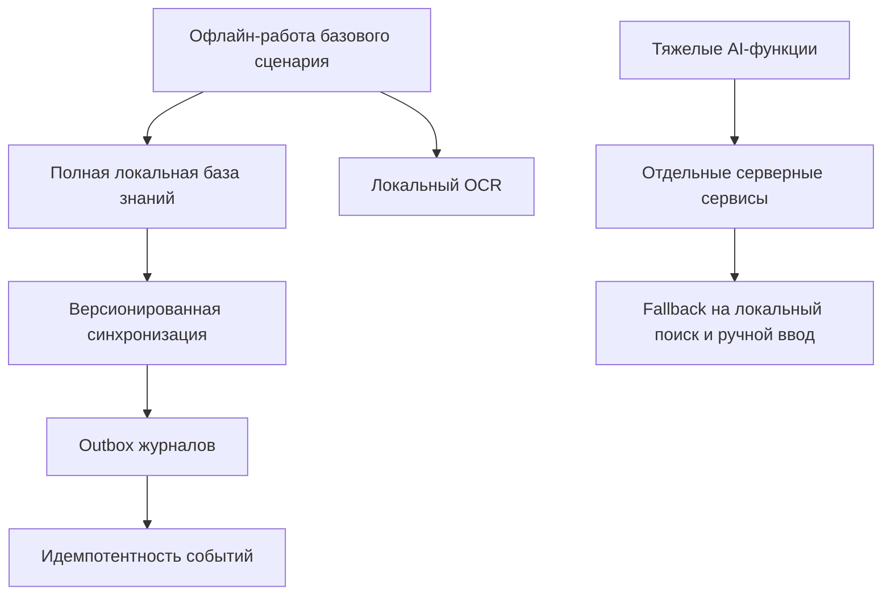

# 04. Архитектурные драйверы

## Ключевые драйверы

| Драйвер | Почему важен | Влияние на архитектуру | Как проверять |
|---|---|---|---|
| Работа без сети для базового сценария | Техник может находиться на участке без стабильной связи | Полная база знаний, OCR, чек-листы и журналы хранятся локально | Offline E2E |
| Централизованная актуальность инструкций | Устаревшая инструкция повышает риск ошибки обслуживания | Knowledge Sync Service управляет `knowledge_base_version` и `instruction_version` | Тест обновления базы знаний |
| Идемпотентная синхронизация | Outbox может отправлять события повторно | `operation_event_id` и `idempotency_key` обязательны | Failure tests |
| Разделение тяжелых AI-функций | LLM/RAG/STT/TTS требуют серверных ресурсов и могут масштабироваться отдельно | Search/RAG Service и Speech Service вынесены в отдельные сервисы | Нагрузочные и contract tests |
| Простота MVP-клиента | Android Client должен быть автономным, но не перегруженным сложными моделями | Клиент хранит знания и OCR, но не запускает LLM/STT/TTS | Архитектурное ревью |
| Безопасность журналов работ | Журналы содержат данные о персонале, оборудовании и результатах операций | Авторизация, ownership checks, структурные логи без секретов | Security tests |
| Сопровождаемость базы знаний | Администратор должен обновлять контент без изменения кода клиента | Admin Panel и Documentation Service отделены от Android Client | Acceptance scenario |

## Компромиссы

| Решение | Выигрыш | Цена |
|---|---|---|
| Полная база знаний на устройстве | Офлайн-работа и быстрый локальный поиск | Нужно контролировать размер базы, версии и миграции |
| OCR локально | Сканирование возможно без сети | Точность зависит от камеры, освещения и локальной модели |
| LLM/RAG/STT/TTS только онлайн | Можно использовать более тяжелые и качественные модели | При потере сети эти функции недоступны |
| Backend как набор отдельных сервисов | AI, синхронизацию и документацию можно масштабировать независимо | Больше контрактов, мониторинга и интеграционных тестов |
| EAM вне MVP | MVP не зависит от внешней корпоративной интеграции | Передачу журналов в EAM нужно будет проектировать позже |

## Карта влияния

## Решения, требующие ADR

- Выделить backend в отдельные сервисы.
- Хранить полную базу знаний локально на Android-устройстве.
- Оставить OCR локальным, а LLM/RAG/STT/TTS выполнять онлайн.
- Отложить EAM-интеграцию и AR-очки за пределы MVP.

## Допущения

- Размер полной базы знаний допустим для хранения на типовом Android-устройстве целевой аудитории.
- Инкрементальные обновления базы знаний можно применять без полной переустановки приложения.
- Серверные AI-сервисы могут быть временно недоступны без остановки базового сценария обслуживания.
