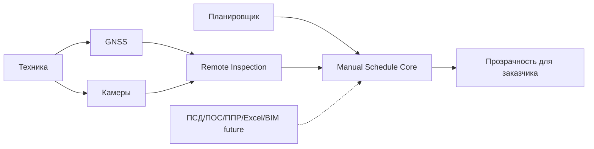

# 04. Архитектурные драйверы

> Сокращения и рабочие термины расшифрованы в [словаре терминов](13-термины-и-сокращения.md).

## Ключевые драйверы

| Драйвер | Почему важен | Архитектурное следствие |
|---|---|---|
| Ручное ведение КСГ в MVP | Пользователь хочет сначала простой управляемый график без сложного анализа документов | Нужен удобный UI и audit trail изменений |
| Удаленный инспектор | Нужно сократить выезды инспекторов и дать заказчику удаленный контроль | Нужен контур камер, просмотра и записей проверки |
| Камеры и GNSS на технике | Это первые реальные источники объективных данных | Нужен учет техники, устройств, координат и медиаматериалов |
| Пикетаж железнодорожной стройки | Работы распределены вдоль пути | Нужны линейные координаты и фильтры по участкам |
| Нет автообновления КСГ в MVP | Нельзя выдавать сигналы техники за принятый факт | Устройства не имеют прав менять график напрямую |
| Модульное развитие | Импорт документов, BIM, ML, БПЛА и материалы будут подключаться позже | Нужны расширяемые контракты без усложнения MVP |
| Доверие к данным | Подрядчик может спорить с выводами | Нужны роли, доказательства, история и неизменяемый журнал |

## Компромиссы

| Решение | Выигрыш | Цена |
|---|---|---|
| Начать с ручного КСГ | Быстро проверяем ценность и UX | Меньше автоматизации документов |
| Удаленный инспектор вместо выезда на каждый объект | Снижает трудозатраты | Качество зависит от камер и связи |
| Камеры + GNSS как первые устройства | Реалистично для прототипа | Не доказывает факт без человека |
| Импорт документов как future scope | Не перегружает MVP | Планировщик больше вводит руками |
| Модули через единый контракт | Можно развивать систему | Требует аккуратного проектирования границ |

## Карта влияния

## Решения, требующие ADR

- Начать с ручного ведения КСГ и не включать автоматический импорт документов в MVP.
- Сделать удаленного инспектора и камеры на технике ключевым способом контроля MVP.
- Сделать пикетаж обязательной координатой железнодорожных работ.
- Подключать будущие источники автоматизации через контракт сигналов, не давая им напрямую менять КСГ.

## Допущения

- Камеры и GNSS реально можно установить на технику подрядчиков.
- Точности около 2 м достаточно для первичного понимания местоположения техники; RTK нужен только для отдельных высокоточных сценариев.
- Первый пилот может обойтись без автоматического анализа документов.
- Пикетаж можно привести к единому формату `км`, `ПК`, `смещение`.
