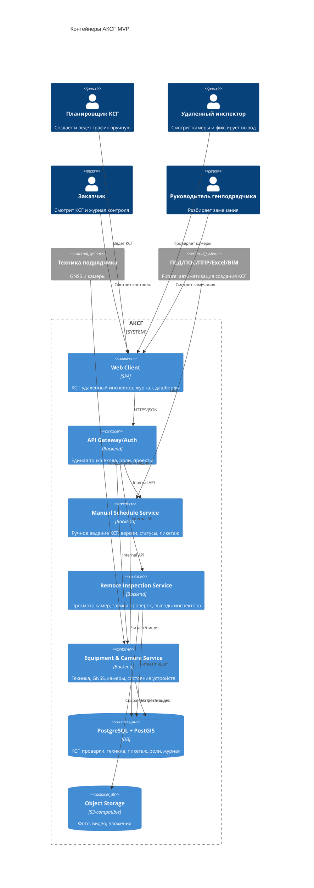

# 05. Архитектура

> Сокращения и рабочие термины расшифрованы в [словаре терминов](13-термины-и-сокращения.md).

## Архитектурный стиль

АКСГ проектируется как модульная web-платформа. Ядро MVP состоит из ручного ведения КСГ, удаленного инспектирования, учета техники с GNSS и камер, хранилища доказательных материалов и журнала изменений. Автоматический импорт документов, BIM, ML и расширенная план-факт аналитика проектируются как future scope.

## C4 Container

## Ответственность контейнеров

| Контейнер | Ответственность |
|---|---|
| Web Client | Работа с КСГ, камерами, журналом проверок, ролями и отчетами |
| API Gateway/Auth | Аутентификация, авторизация, маршрутизация, project isolation |
| Manual Schedule Service | Проекты, ручные работы КСГ, статусы, версии, пикетаж, история изменений |
| Remote Inspection Service | Сессии удаленного инспектора, выводы, замечания, связь с фото/видео |
| Equipment & Camera Service | Техника, GNSS-координаты, камеры, привязка к проекту |
| PostgreSQL + PostGIS | КСГ, пикетаж, проверки, техника, пользователи, аудит |
| Object Storage | Фото, видео, вложения и технические материалы |

## Ключевые политики

- КСГ изменяется только пользователем с правами, не устройством и не камерой.
- Запись удаленного инспектора хранит ссылку на доказательные материалы и пользователя.
- GNSS и камеры являются частью системы АКСГ, но их сигналы не закрывают работу автоматически.
- Все ручные изменения КСГ сохраняются в истории.
- Future-модули импорта документов и BIM должны подключаться без изменения ручного ядра КСГ.

## ADR

- [ADR-0001: Начать с ручного ведения КСГ](adr/0001-начать-с-ручного-ведения-ксг.md)
- [ADR-0002: Сделать удаленного инспектора основой контроля MVP](adr/0002-сделать-удаленного-инспектора-основой-контроля.md)
- [ADR-0003: Сделать пикетаж обязательной координатой железнодорожных работ](adr/0003-сделать-пикетаж-обязательной-координатой.md)
- [ADR-0004: Подключать будущие источники автоматизации через контракт сигналов](adr/0004-подключать-источники-автоматизации-через-контракт.md)
