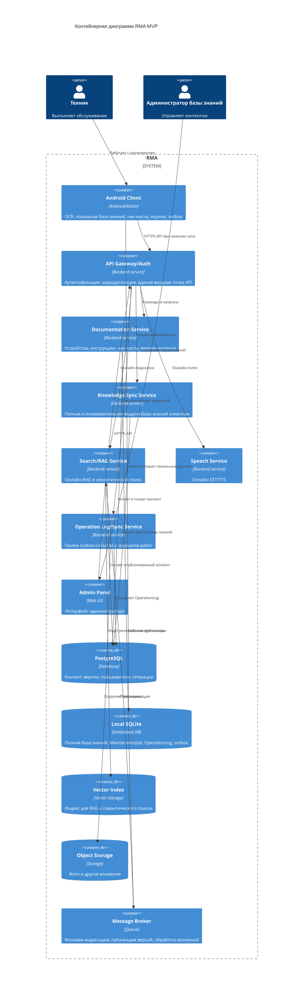
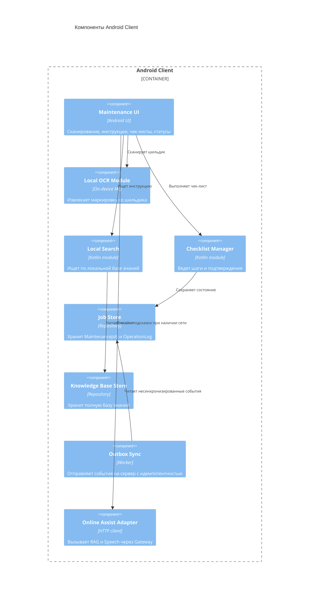

# 05. Архитектура

## Архитектурный стиль

RMA строится как offline-capable Android Client и набор специализированных backend-сервисов. Android Client является основным рабочим инструментом техника и хранит локальный источник для полевого сценария: полную базу знаний, OCR-модуль, чек-листы, локальный журнал и outbox. Backend отвечает за публикацию знаний, синхронизацию, администрирование и тяжелые онлайн-функции.

## C4 Container

## Ответственность контейнеров

| Контейнер | Ответственность |
|---|---|
| Android Client | Основной UI техника, локальный OCR, локальный поиск, чек-листы, журналы, outbox |
| API Gateway/Auth | Авторизация, проверка токенов, маршрутизация API, выдача `correlation_id` |
| Documentation Service | Управление устройствами, инструкциями, чек-листами и версиями |
| Knowledge Sync Service | Выдача полной базы знаний и инкрементальных обновлений |
| Search/RAG Service | Онлайн-помощь, семантический поиск, RAG по опубликованной базе знаний |
| Speech Service | STT/TTS для голосового ввода и голосовых подсказок при наличии сети |
| Operation Log/Sync Service | Прием outbox-событий, идемпотентность, сохранение журналов |
| Admin Panel | Пользовательский интерфейс администратора |
| Local SQLite | Локальная полная база знаний и состояние операций |

## C4 Component: Android Client

## Ключевые политики

| Политика | Где реализуется | Почему здесь | Как проверить |
|---|---|---|---|
| Версионирование базы знаний | Documentation Service, Knowledge Sync Service, Android Client | Клиент должен знать, какую версию хранит локально | Contract и integration tests |
| Фиксация версии инструкции в операции | Checklist Manager, Job Store | Операция должна продолжаться с той инструкцией, с которой началась | E2E-тест обновления во время операции |
| Идемпотентность outbox | Android Client, Operation Log/Sync Service | Сеть может обрываться, события могут отправляться повторно | Failure test |
| Fallback онлайн-функций | Android Client | Техник не должен терять базовый сценарий при отказе RAG/STT/TTS | E2E-тест отказа сервисов |
| Ownership checks | API Gateway/Auth, Operation Log/Sync Service | Техник не должен видеть чужие операции | Security tests |

## ADR

- [ADR-0001: Выделить backend в отдельные сервисы](adr/0001-выделить-backend-в-отдельные-сервисы.md)
- [ADR-0002: Хранить полную базу знаний локально](adr/0002-хранить-полную-базу-знаний-локально.md)
- [ADR-0003: Разделить локальный OCR и онлайн AI-функции](adr/0003-разделить-локальный-ocr-и-онлайн-ai-функции.md)
- [ADR-0004: Отложить EAM-интеграцию и AR-очки](adr/0004-отложить-eam-и-ar-очки.md)
