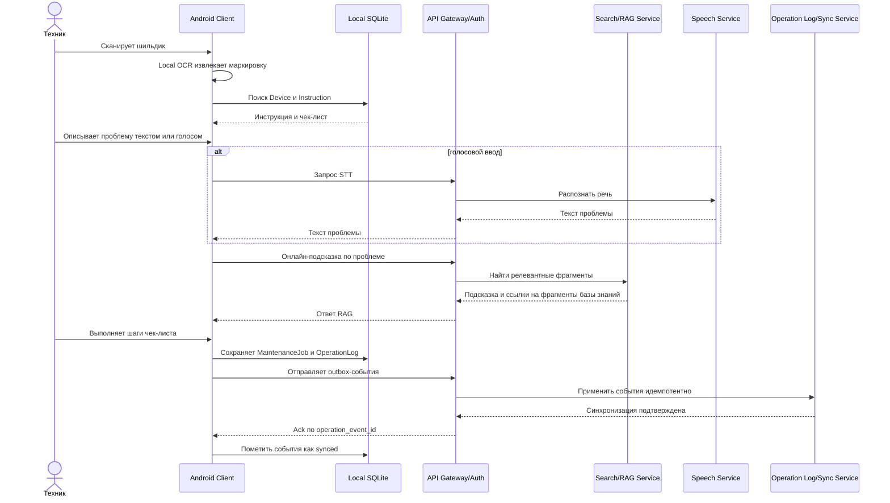
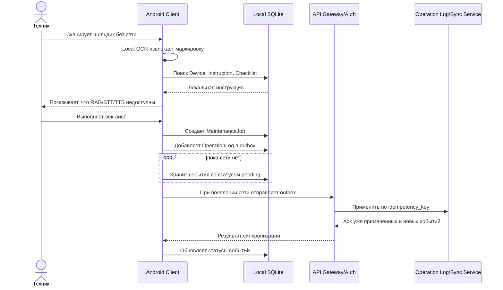
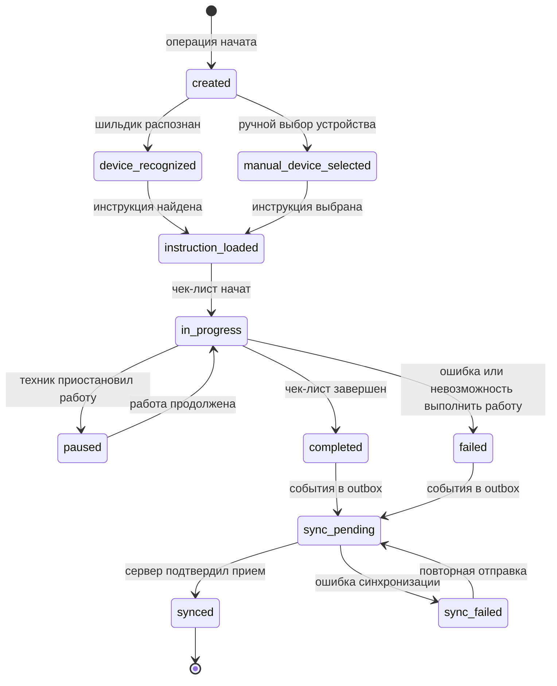

# 06. Сценарии и потоки

## Основной онлайн-сценарий

Сеть доступна, поэтому техник использует локальный OCR и базу знаний, а также онлайн-помощь RAG или Speech при необходимости.

## Офлайн-сценарий с последующей синхронизацией

Базовый сценарий не зависит от сети: вся база знаний уже находится на Android-устройстве.

## Обновление базы знаний

1. Администратор меняет устройства, инструкции или чек-листы в Admin Panel.
2. Documentation Service сохраняет черновик и после публикации создает новую `knowledge_base_version`.
3. Knowledge Sync Service готовит пакет полной базы знаний или инкрементальное обновление.
4. Android Client периодически проверяет доступную версию.
5. Клиент скачивает обновление, проверяет контрольную сумму и применяет миграцию локального хранилища.
6. Уже начатые операции продолжают ссылаться на старую `instruction_version`.
7. Новые операции используют актуальную версию базы знаний.

## Жизненный цикл MaintenanceJob

## Правила повторов

| Повтор | Правило |
|---|---|
| Повторная отправка `OperationLog` | Сервер применяет событие один раз по `operation_event_id` и `idempotency_key` |
| Повторная загрузка обновления базы знаний | Клиент проверяет `knowledge_base_version` и контрольную сумму |
| Повторный OCR одного шильдика | Создает новую попытку распознавания внутри той же операции |
| Повторный онлайн-RAG запрос | Не меняет состояние операции, сохраняется только как подсказка при необходимости |

## Ошибочные ветки

- Если OCR не уверен в результате, пользователь подтверждает устройство вручную.
- Если локальная база знаний повреждена, приложение блокирует начало новых операций и требует переустановки/повторной загрузки базы знаний.
- Если синхронизация вложения не удалась, `OperationLog` остается в outbox до успешной отправки или ручного решения.
- Если сервер вернул конфликт версии, клиент не меняет уже завершенную операцию, а сохраняет диагностическое событие.
