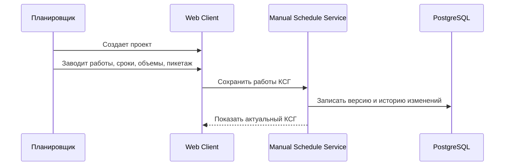
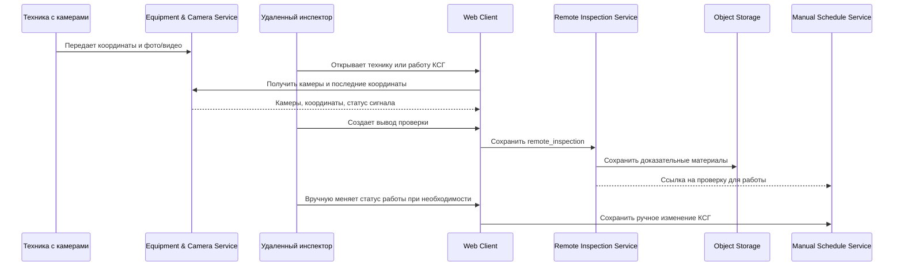
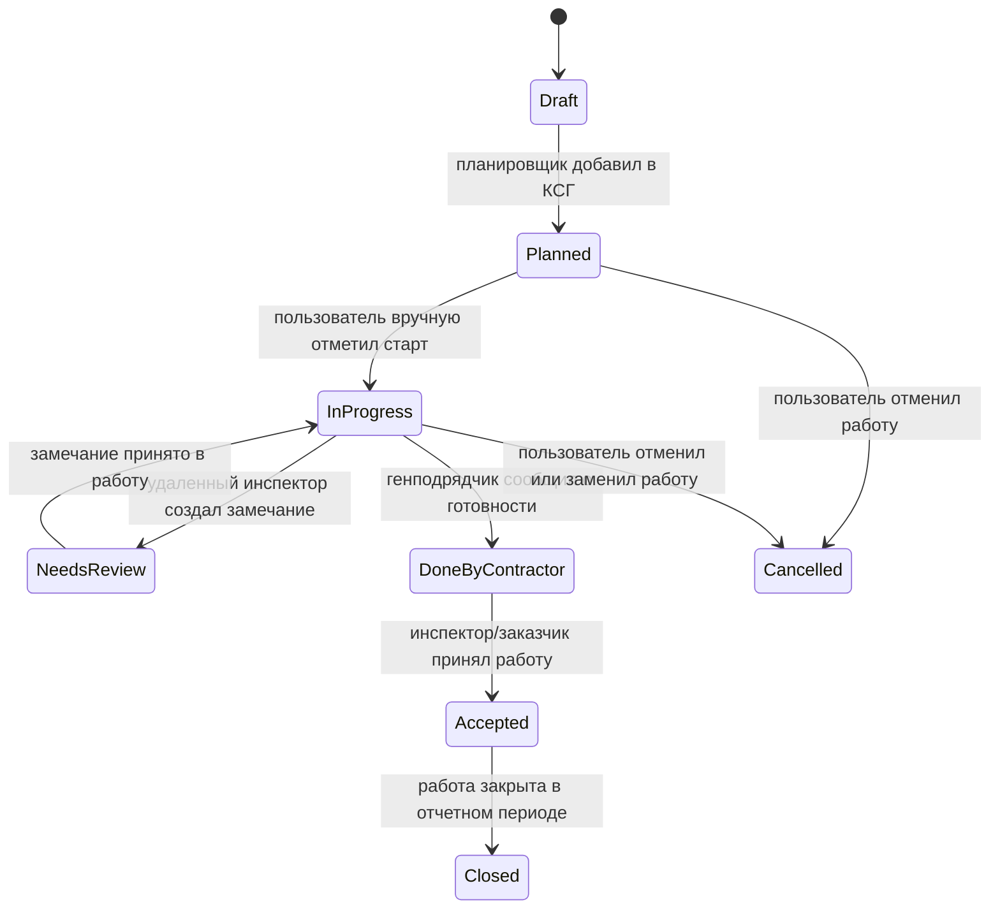

# 06. Сценарии и потоки

> Сокращения и рабочие термины расшифрованы в [словаре терминов](13-термины-и-сокращения.md).

## Ручное создание и ведение КСГ

## Удаленная проверка через камеры на технике

## Жизненный цикл WorkItem

## Правила повторов

- Запись удаленного инспектора передает `client_event_id`; повторная отправка не создает дубль.
- Медиафайл имеет checksum; повторная загрузка связывается с той же проверкой.
- GNSS/ГЛОНАСС-точки дедуплицируются по `equipment_id`, времени и sequence number, если он доступен.
- Ручное изменение КСГ создает отдельную запись истории и не перезаписывает старую без следа.

## Ошибочные ветки

| Ошибка | Реакция |
|---|---|
| Камера недоступна | Показать статус нет сигнала и дать создать замечание |
| GNSS/ГЛОНАСС не передает координаты | Показать последнюю координату и время сигнала |
| Инспектор не уверен в факте | Создать статус `needs_on_site_check` или `needs_clarification` |
| Пользователь без прав пытается менять КСГ | Запретить действие и записать security event |
| Медиафайл не загрузился | Не принимать запись проверки как полную, предложить повтор |
| Future-импорт документов еще не реализован | Документ хранится как вложение без автоматического создания работ |
