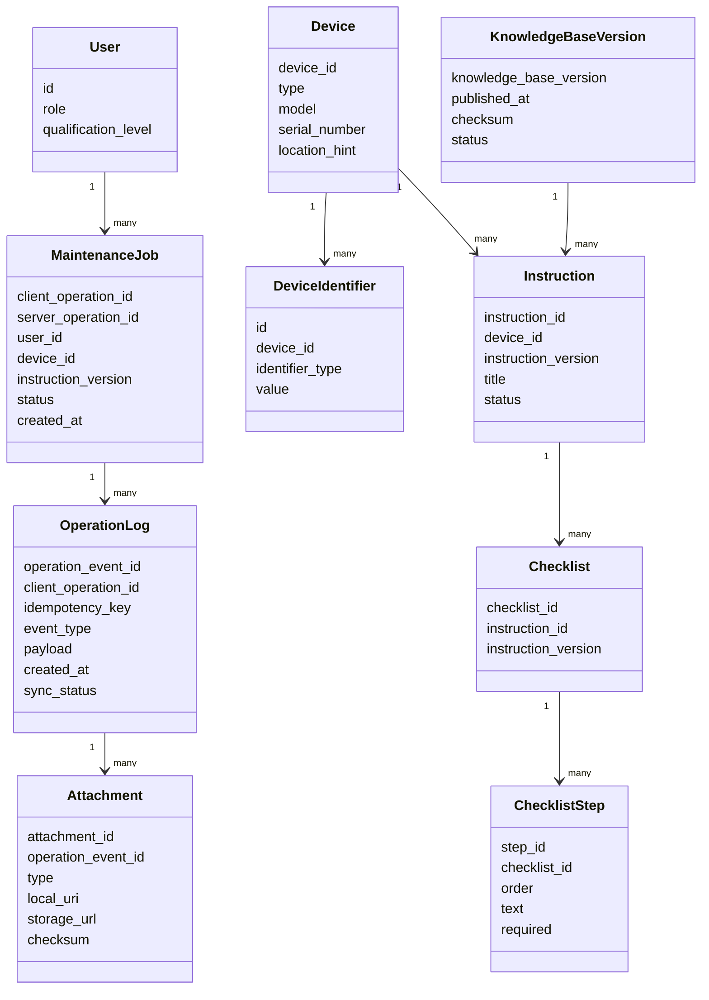

# 07. Данные и хранилища

## Основные сущности

| Сущность | Назначение |
|---|---|
| User | Техник, администратор или инженер эксплуатации |
| Device | Оборудование железнодорожной инфраструктуры |
| DeviceIdentifier | Признаки шильдика: модель, серийный номер, тип, код |
| Instruction | Инструкция или решение по устройству |
| Checklist | Набор шагов для выполнения операции |
| ChecklistStep | Отдельный шаг чек-листа |
| KnowledgeBaseVersion | Опубликованная версия полной базы знаний |
| MaintenanceJob | Сессия обслуживания оборудования |
| OperationLog | Событие или запись о выполненной работе |
| OutboxEvent | Локальное событие, ожидающее синхронизации |
| Attachment | Фото или другой разрешенный артефакт операции |

## ER/Class diagram

## Хранилища

| Хранилище | Где находится | Ответственность |
|---|---|---|
| Local SQLite | Android-устройство | Полная база знаний, локальные операции, outbox, статусы синхронизации |
| PostgreSQL | Backend data layer | Пользователи, опубликованные версии базы знаний, серверные журналы |
| Vector Index | Backend data layer | Векторный индекс для Search/RAG Service |
| Object Storage | Backend data layer | Фото и другие вложения к операциям |
| Message Broker | Backend infrastructure | Фоновая индексация, публикация версий, обработка вложений |

## Источник истины

- Для опубликованной базы знаний источником истины является backend: Documentation Service и PostgreSQL.
- Для текущей офлайн-операции до синхронизации источником истины является Local SQLite на Android-устройстве.
- После успешной синхронизации серверная запись `OperationLog` становится источником истины для отчетности.
- Vector Index не является источником истины: его можно перестроить по опубликованным инструкциям.
- Object Storage хранит артефакты, а metadata и связи с операцией хранятся в PostgreSQL.

## Правила хранения

| Данные или артефакт | Источник истины | Срок хранения | Как удалить или восстановить |
|---|---|---|---|
| Опубликованная база знаний | Backend PostgreSQL | Пока версия поддерживается | Повторно скачать на клиент или восстановить из backup |
| Локальная база знаний | Local SQLite | До замены новой версией | Повторная загрузка `knowledge_base_version` |
| MaintenanceJob до sync | Local SQLite | До успешной синхронизации и локальной политики retention | Повторить outbox sync |
| OperationLog после sync | Backend PostgreSQL | По политике аудита | Восстановить из backup или audit trail |
| Attachment | Object Storage | По политике хранения вложений | Metadata остается в PostgreSQL |
| Vector Index | Vector storage | Пока актуальна версия базы знаний | Перестроить по Instruction |

## Миграции и совместимость

- Каждая опубликованная база знаний имеет `knowledge_base_version`.
- Каждая инструкция имеет `instruction_version`.
- `MaintenanceJob` фиксирует `instruction_version`, чтобы операция не изменилась при обновлении базы знаний.
- Инкрементальные обновления применяются только после проверки контрольной суммы.
- При несовместимой миграции клиент скачивает полную версию базы знаний.

## Данные для идемпотентности

- `client_operation_id` создается на Android Client и уникален в пределах устройства.
- `operation_event_id` создается для каждого события журнала.
- `idempotency_key` передается при синхронизации и хранится на сервере.
- Сервер хранит факт применения события и возвращает ack при повторной отправке.
- `correlation_id` связывает HTTP-запрос, обработку backend-сервиса и запись журнала.
