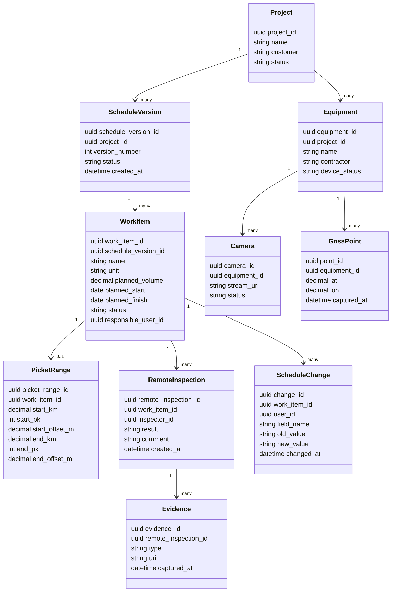

# 07. Данные и хранилища

> Сокращения и рабочие термины расшифрованы в [словаре терминов](13-термины-и-сокращения.md).

## Основные сущности

| Сущность | Назначение |
|---|---|
| `Project` | Строительный проект или объект контроля |
| `ScheduleVersion` | Версия вручную веденного КСГ |
| `WorkItem` | Работа КСГ: сроки, объем, статус, ответственный, пикетаж |
| `PicketRange` | Линейная координата участка работ |
| `Equipment` | Техника подрядчика, подключенная к системе |
| `Camera` | Камера, установленная на технике |
| `GnssPoint` | Координата техники во времени |
| `RemoteInspection` | Запись удаленной проверки инспектором |
| `Evidence` | Фото, видео, координаты или вложение проверки |
| `ScheduleChange` | История ручного изменения КСГ |
| `UserRole` | Роль пользователя в проекте |

## ER/Class diagram

## Хранилища

| Хранилище | Данные |
|---|---|
| PostgreSQL + PostGIS | Проекты, КСГ, пикетаж, проверки, техника, камеры, GNSS-точки, аудит |
| Object Storage | Фото, видео, вложения и материалы проверок |
| Message Broker, optional | Future: асинхронная обработка медиа, сигналов и интеграций |
| Time-series storage, optional | Future: высокочастотная телеметрия техники |

## Источник истины

| Данные | Источник истины |
|---|---|
| КСГ MVP | Ручные записи `WorkItem` и `ScheduleChange` |
| Факт проверки | `RemoteInspection`, созданный пользователем |
| Фото/видео | `Evidence` в объектном хранилище |
| Координаты техники | `GnssPoint` от устройства на технике |
| Изменение графика | Ручное действие пользователя с правами |

## Правила хранения

- Ручные изменения КСГ не удаляются физически; сохраняется история.
- Фото и видео доступны только пользователям проекта с нужной ролью.
- Камера и GNSS/ГЛОНАСС-устройство не могут напрямую менять `WorkItem`.
- Для видео и координат нужна retention policy, чтобы не переполнить хранилище.
- Future-документы ПСД/ПОС/ППР/BIM можно хранить как вложения до реализации импорта.

## Миграции и совместимость

- Сначала стабилизировать модель ручного КСГ, потом добавлять импортные поля.
- Для future-источников сигналов использовать версионируемый payload.
- При изменении формата пикетажа хранить нормализованные координаты и исходное текстовое представление.

## Данные для идемпотентности

- `client_event_id` для записей удаленного инспектора.
- checksum для фото/видео.
- `equipment_id`, timestamp и sequence number для GNSS/ГЛОНАСС-точек.
- `correlation_id` для сквозной диагностики проверки, медиа и изменения КСГ.
