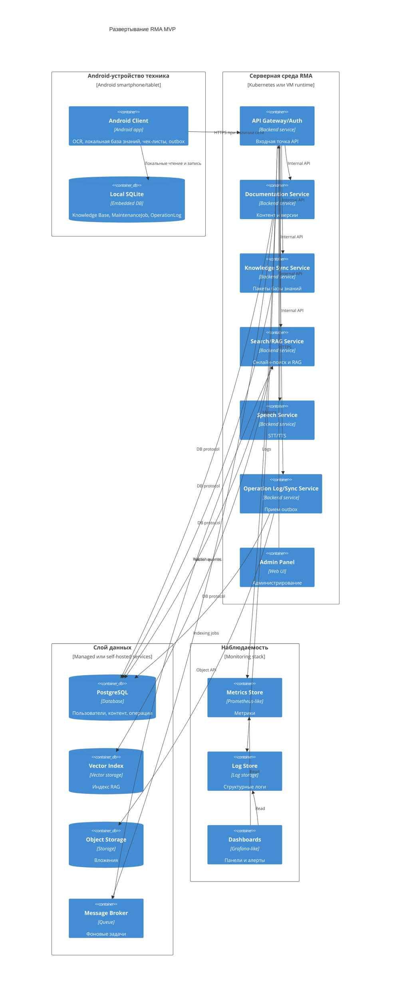

# 08. Развертывание

## Целевая среда MVP

MVP разворачивается в двух средах:

- Android-устройства техников: смартфоны и планшеты.
- Серверная среда RMA: backend-сервисы, хранилища, очередь, Admin Panel и observability.

AR-очки и EAM-система не являются deployable-компонентами MVP.

## C4 Deployment

## Сетевые связи

| Откуда | Куда | Протокол | Назначение |
|---|---|---|---|
| Android Client | API Gateway/Auth | HTTPS | Синхронизация, обновления, онлайн-помощь |
| Admin Panel | API Gateway/Auth | HTTPS | Управление базой знаний |
| API Gateway/Auth | Backend-сервисы | Internal HTTP/gRPC | Маршрутизация команд и запросов |
| Backend-сервисы | PostgreSQL | DB protocol | Хранение состояния и контента |
| Search/RAG Service | Vector Index | Vector API | Семантический поиск |
| Operation Log/Sync Service | Object Storage | Object API | Загрузка вложений |
| Documentation Service | Message Broker | Broker protocol | События публикации и переиндексации |

## Stateful и stateless компоненты

| Компонент | Тип |
|---|---|
| Android Client | Stateful из-за Local SQLite |
| Local SQLite | Stateful |
| API Gateway/Auth | Stateless |
| Documentation Service | Stateless при внешнем PostgreSQL |
| Knowledge Sync Service | Stateless при внешнем PostgreSQL/Object Storage |
| Search/RAG Service | Stateless при внешнем Vector Index |
| Speech Service | Stateless, но ресурсоемкий |
| Operation Log/Sync Service | Stateless при внешнем PostgreSQL/Object Storage |
| PostgreSQL, Vector Index, Object Storage, Message Broker | Stateful |

## Конфигурация и секреты

- Секреты backend-сервисов хранятся в защищенном secret storage среды развертывания.
- Android Client не хранит серверные секреты; он хранит только пользовательские токены и локальные ключи в защищенном хранилище Android.
- API Gateway/Auth отвечает за проверку токенов и передачу user context во внутренние сервисы.
- Конфигурация адресов сервисов и feature flags задается через окружение backend и remote config клиента.

## Масштабирование

- Search/RAG Service и Speech Service масштабируются отдельно от Documentation Service.
- Operation Log/Sync Service масштабируется по нагрузке outbox-синхронизации.
- Knowledge Sync Service масштабируется по числу клиентов, скачивающих обновления.
- Android Client не зависит от горизонтального масштабирования backend для офлайн-сценария.
