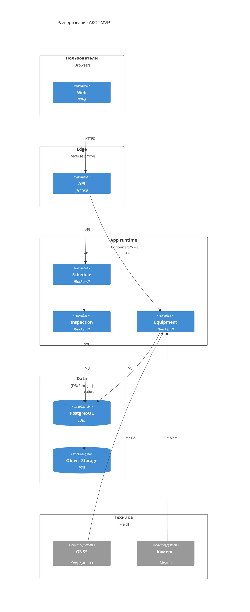

# 08. Развертывание

> Сокращения и рабочие термины расшифрованы в [словаре терминов](13-термины-и-сокращения.md).

## Целевая среда MVP

MVP разворачивается как web-платформа для ручного ведения КСГ и удаленного инспектирования. На технику подрядчиков устанавливаются GNSS-модули и камеры, которые передают координаты и фото/видео в АКСГ.

Минимальная среда:

- reverse proxy/API Gateway;
- backend-приложение или набор модулей;
- PostgreSQL + PostGIS;
- объектное хранилище для фото/видео;
- web static hosting;
- observability stack.

## C4 Deployment

## Сетевые связи

| Связь | Протокол | Комментарий |
|---|---|---|
| Пользователи -> API Gateway | HTTPS | Авторизация, роли, project scope |
| GNSS -> Equipment API | HTTPS/MQTT/provider API | Зависит от выбранного оборудования |
| Камеры -> Equipment/Media API | RTSP/WebRTC/HTTPS upload, TBD | Формат нужно выбрать после прототипа |
| Backend -> PostgreSQL | TLS SQL | Доступ только из application runtime |
| Backend -> Object Storage | S3 API | Фото, видео, вложения |

## Stateful и stateless компоненты

Stateful:

- PostgreSQL + PostGIS;
- Object Storage;
- возможное future-хранилище телеметрии и видеоархива.

Stateless:

- Web Client;
- API Gateway/Auth;
- backend-модули ручного КСГ, удаленного инспектора и техники.

## Конфигурация и секреты

- Секреты подключения к БД, объектному хранилищу и устройствам хранятся в secret manager или защищенных переменных окружения.
- Доступ к проектам разграничивается по ролям и `project_id`.
- Ключи устройств GNSS и камер выдаются индивидуально и могут быть отозваны.
- Камеры не должны быть доступны публично без авторизации АКСГ.

## Масштабирование

- Поток фото/видео масштабируется отдельно от ручного API КСГ.
- Object Storage выносит тяжелые медиафайлы из БД.
- При росте координат детальные GNSS-точки можно перенести в time-series storage.
- Импорт документов и автоматическая аналитика масштабируются отдельно в будущих версиях.
