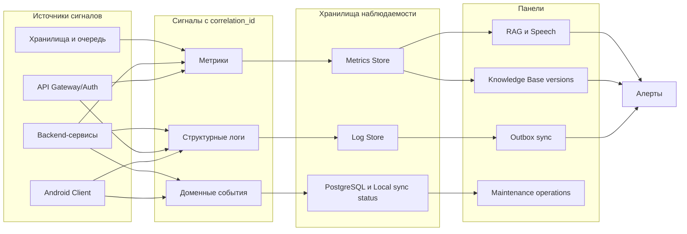

# 09. Надежность и эксплуатация

## Ключевые отказы

| Отказ | Поведение системы |
|---|---|
| Нет сети у техника | Android Client продолжает локальный OCR, поиск по Knowledge Base, чек-лист и запись OperationLog |
| Search/RAG Service недоступен | Клиент использует локальный поиск; онлайн-подсказка помечается недоступной |
| Speech Service недоступен | Клиент использует ручной текстовый ввод |
| Синхронизация outbox прервалась | События остаются `pending` и отправляются повторно |
| Повторная доставка outbox-события | Operation Log/Sync Service применяет событие один раз |
| Knowledge Sync Service недоступен | Клиент продолжает работать с текущей `knowledge_base_version` |
| Локальная база знаний повреждена | Клиент блокирует новые операции и требует повторной загрузки базы знаний |
| Переиндексация RAG не завершилась | Search/RAG Service использует предыдущий индекс или отключает онлайн-подсказки для новой версии |

## Повторы и идемпотентность

- Каждое событие outbox имеет `operation_event_id` и `idempotency_key`.
- Сервер хранит факт применения события и возвращает ack при повторной отправке.
- Вложения синхронизируются с checksum; повторная загрузка не создает новый артефакт без необходимости.
- Обновления базы знаний применяются только после проверки `knowledge_base_version` и checksum.
- RAG/STT/TTS запросы не меняют критичное состояние операции и могут повторяться без влияния на `MaintenanceJob`.

## Диагностическая цепочка

## Минимальный набор сигналов

| Тип сигнала | Что включить | Зачем |
|---|---|---|
| Android logs | `client_operation_id`, `operation_event_id`, `knowledge_base_version`, `sync_status`, `error_code` | Разбор локальных и sync-сбоев |
| Backend logs | `correlation_id`, `user_id`, `service`, `operation_event_id`, `idempotency_key`, `error_code` | Связать запросы и события между сервисами |
| Metrics | Возраст outbox, число pending events, ошибки sync, версии базы знаний, latency RAG/STT/TTS | Раннее обнаружение деградации |
| Domain events | Публикация базы знаний, начало операции, завершение операции, sync ack, sync conflict | Восстановление истории процесса |

## Алерты

| Алерт | Условие |
|---|---|
| Outbox sync деградирует | Растет средний возраст pending-событий |
| Ошибки Knowledge Sync | Клиенты не могут скачать новую версию базы знаний |
| AI-сервисы недоступны | Ошибки Search/RAG или Speech выше порога |
| Дубли outbox | Сервер часто получает уже примененные события сверх ожидаемого уровня |
| Ошибки локальной базы | Клиенты сообщают о повреждении Knowledge Base |

## Резервное копирование и восстановление

- PostgreSQL резервируется по расписанию и перед публикацией крупных обновлений базы знаний.
- Object Storage хранит вложения с metadata в PostgreSQL.
- Vector Index можно перестроить по опубликованной базе знаний.
- Local SQLite на устройстве не считается централизованным backup, но outbox хранится до успешной синхронизации.
- При потере устройства несинхронизированные операции могут быть потеряны; это отдельный риск MVP.

## Ручные действия оператора

- Проверить конкретную операцию по `client_operation_id`.
- Найти событие по `operation_event_id` и посмотреть, применено ли оно сервером.
- Повторно запустить сборку или публикацию `knowledge_base_version`.
- Отключить онлайн-RAG или Speech через feature flag при деградации.
- Запустить переиндексацию Vector Index для конкретной версии базы знаний.
