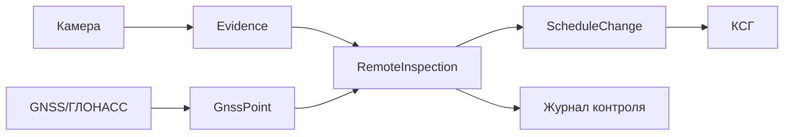

# 09. Надежность и эксплуатация

> Сокращения и рабочие термины расшифрованы в [словаре терминов](13-термины-и-сокращения.md).

## Ключевые отказы

| Отказ | Влияние | Поведение |
|---|---|---|
| Камера техники недоступна | Удаленный инспектор не видит объект | Показать нет сигнала, дать создать замечание или запросить выездную проверку |
| GNSS/ГЛОНАСС не передает координаты | Нет объективной точки техники | Показать последнюю координату и время сигнала |
| Объектное хранилище недоступно | Нельзя сохранить фото/видео | Не считать запись проверки полной, retry |
| Ошибка ручного изменения КСГ | Пользователь не может обновить график | Показать ошибку, не терять введенные данные |
| Пользователь ошибочно изменил КСГ | Искажается график | История изменений и возможность компенсирующей правки |
| Потеря связи у инспектора | Нельзя смотреть камеры | Показать состояние связи и не создавать ложный факт |

## Повторы и идемпотентность

- `RemoteInspection` создается один раз по `client_event_id`.
- Медиафайл дедуплицируется по checksum.
- GNSS/ГЛОНАСС-точки дедуплицируются по устройству, времени и sequence number.
- Ручные изменения КСГ не схлопываются: каждое изменение должно быть видно в истории.

## Диагностическая цепочка

## Минимальный набор сигналов

| Сигнал | Назначение |
|---|---|
| Доступность камер | Понимать, можно ли удаленно инспектировать объект |
| Последний GNSS/ГЛОНАСС-сигнал | Контроль живости устройства на технике |
| Количество записей удаленного инспектора | Контроль использования системы |
| Доля проверок с фото/видео | Контроль полноты доказательств |
| Количество ручных изменений КСГ | Контроль активности планировщика |
| Ошибки загрузки медиа | Контроль качества удаленного инспектирования |
| Попытки доступа без прав | Контроль безопасности |

## Алерты

- Камера техники недоступна дольше заданного интервала.
- GNSS/ГЛОНАСС-устройство не передает координаты дольше заданного интервала.
- Ошибки загрузки фото/видео превышают порог.
- Пользователь массово меняет КСГ за короткий период.
- Попытки доступа к чужому проекту или камере.

## Резервное копирование и восстановление

- PostgreSQL: регулярные backups и point-in-time recovery.
- Object Storage: versioning или защищенная корзина для фото/видео.
- Проверка восстановления на тестовой среде перед промышленной эксплуатацией.

## Ручные действия оператора

- Пометить камеру или GNSS/ГЛОНАСС-устройство как неисправное.
- Перепривязать камеру к технике.
- Восстановить ошибочно измененный КСГ компенсирующей правкой.
- Заблокировать пользователя или устройство при подозрении на компрометацию.
- Выгрузить журнал удаленных проверок по проекту.
