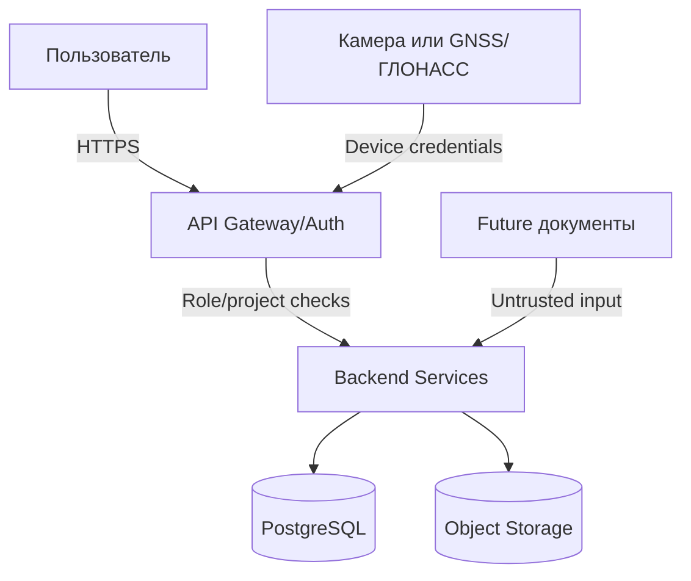

# 10. Безопасность

> Сокращения и рабочие термины расшифрованы в [словаре терминов](13-термины-и-сокращения.md).

## Защищаемые данные

| Данные | Почему защищаем |
|---|---|
| КСГ и история изменений | Управленческая информация проекта |
| Фото/видео с камер техники | Раскрывают состояние объекта, технику и людей на площадке |
| Координаты GNSS/ГЛОНАСС | Показывают местоположение техники подрядчика |
| Записи удаленных проверок | Могут быть спорными доказательствами по работам |
| Учетные записи и роли | Доступ к проектам, камерам и изменению КСГ |
| Future-документы ПСД/ПОС/ППР/BIM | Коммерческая и инженерная информация проекта |

## Роли и права

| Роль | Права |
|---|---|
| `ProjectAdmin` | Управление проектом, ролями, техникой и камерами |
| `Planner` | Ручное создание и изменение КСГ |
| `RemoteInspector` | Просмотр камер, создание записей проверки и замечаний |
| `CustomerViewer` | Просмотр КСГ, камер по разрешению и журнала контроля |
| `ContractorManager` | Просмотр замечаний и статусов по своим работам |
| `IntegrationDevice` | Отправка координат или медиа только от своего устройства |

## Границы доверия

## Аутентификация и авторизация

- Пользователи входят через корпоративный IdP или локальную учетную систему MVP.
- Все запросы проверяются по роли и `project_id`.
- Устройства используют отдельные ключи или сертификаты, не пользовательские токены.
- Камера или GNSS/ГЛОНАСС-модуль не получает прав на изменение КСГ.
- Доступ к фото/видео выдается через backend, а не прямыми публичными ссылками.

## Валидация входов

- Медиафайлы проверяются на допустимый тип, размер и связь с проектом.
- Координаты и пикетаж валидируются по границам проекта.
- В future-импорте Excel, PDF, DOCX, BIM и архивы считаются недоверенными входами.
- В API запрещены произвольные SQL/фильтры без whitelist.

## Что нельзя логировать

- Секреты, токены, ключи устройств.
- Прямые ссылки с долгоживущим доступом к камерам, фото и видео.
- Полные персональные данные пользователей без необходимости.
- Сырые координаты за пределами диагностических задач и retention policy.
- Полное содержимое проектных документов future-модулей.

## Основные угрозы и меры

| Угроза | Меры |
|---|---|
| Пользователь подменяет факт | Роли, audit trail, фото/видео, история изменений |
| Камера или устройство скомпрометированы | Индивидуальные ключи, отзыв устройства, контроль аномалий |
| Утечка видео стройки | RBAC, непубличное object storage, короткоживущие ссылки |
| Несанкционированное изменение КСГ | Права `Planner`, журнал изменений, compensating change |
| Подмена координат техники | Подпись сообщений, проверка устройства, аномалии маршрута |
| Загрузка вредоносного файла в future-импорте | Ограничения форматов, sandbox обработки, сканирование |

## Допущения

- Требования к ГОСТ/152-ФЗ/корпоративной ИБ пока не уточнены.
- Юридическая значимость фото/видео и электронной подписи требует отдельного согласования.
- В MVP возможна ограниченная авторизация без полного SSO, если пилот проходит в закрытой среде.
