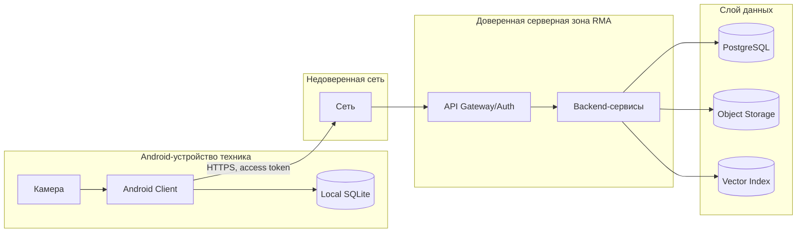

# 10. Безопасность

## Защищаемые данные

| Данные | Почему защищаются |
|---|---|
| Учетные записи и роли пользователей | Определяют доступ к операциям и админке |
| OperationLog и MaintenanceJob | Содержат сведения о работах, оборудовании и сотруднике |
| Вложения к операциям | Могут содержать изображения оборудования или служебной информации |
| База знаний | Может содержать внутренние инструкции и регламенты |
| Токены доступа | Позволяют обращаться к API |
| Логи и диагностические данные | Могут раскрывать идентификаторы устройств и детали операций |

## Роли и права

| Роль | Права |
|---|---|
| Техник | Читать локальную базу знаний, создавать операции, синхронизировать свои журналы |
| Обучающийся сотрудник | Читать инструкции и выполнять учебные чек-листы, если такая политика включена |
| Администратор базы знаний | Создавать и публиковать устройства, инструкции, чек-листы и версии базы знаний |
| Инженер эксплуатации RMA | Смотреть технические метрики, ошибки, статусы синхронизации, но не менять контент без отдельной роли |

## Границы доверия

## Аутентификация и авторизация

- Android Client обращается к backend через API Gateway/Auth.
- API Gateway/Auth проверяет токен пользователя и передает user context во внутренние сервисы.
- Operation Log/Sync Service проверяет, что техник имеет право синхронизировать операцию от своего имени.
- Admin Panel доступна только пользователям с ролью администратора.
- Сервисные вызовы между backend-компонентами защищаются внутренней сетью и service credentials.

## Валидация входов

| Вход | Проверки |
|---|---|
| Фото шильдика | Размер, формат, ограничения локальной обработки |
| Ручной текст | Длина, допустимые символы, защита от prompt injection в RAG-контексте |
| Голосовой ввод | Ограничение длительности и размера payload |
| Admin payload | Схема, обязательные поля, версии, права администратора |
| Вложения | Тип файла, размер, checksum, связь с разрешенной операцией |
| Outbox events | Схема, `operation_event_id`, `idempotency_key`, владелец операции |

## Что нельзя логировать

- Access tokens и refresh tokens.
- Полные payload голосовых данных.
- Содержимое вложений.
- Секреты сервисов.
- Избыточные персональные данные пользователя.

## Основные угрозы и меры

| Угроза | Мера снижения |
|---|---|
| Техник синхронизирует чужую операцию | Ownership checks в Operation Log/Sync Service |
| Повторная отправка события меняет журнал дважды | Идемпотентность по `operation_event_id` и `idempotency_key` |
| Утечка базы знаний с устройства | Защищенное локальное хранилище Android и ограничение доступа приложения |
| Вредоносный admin payload | Валидация схемы и прав, аудит публикаций |
| Prompt injection через текст проблемы | Search/RAG Service отделяет пользовательский ввод от системных инструкций и цитирует источники |
| Доступ к вложениям без прав | Object Storage не выдает публичные постоянные ссылки; доступ идет через авторизованный backend |

## Допущения

- В MVP не проектируется отдельная криптографическая схема для каждой инструкции.
- Корпоративный SSO может быть добавлен позже без изменения доменной модели ролей.
- Политика защиты локальной базы знаний уточняется при переходе к промышленному внедрению.
