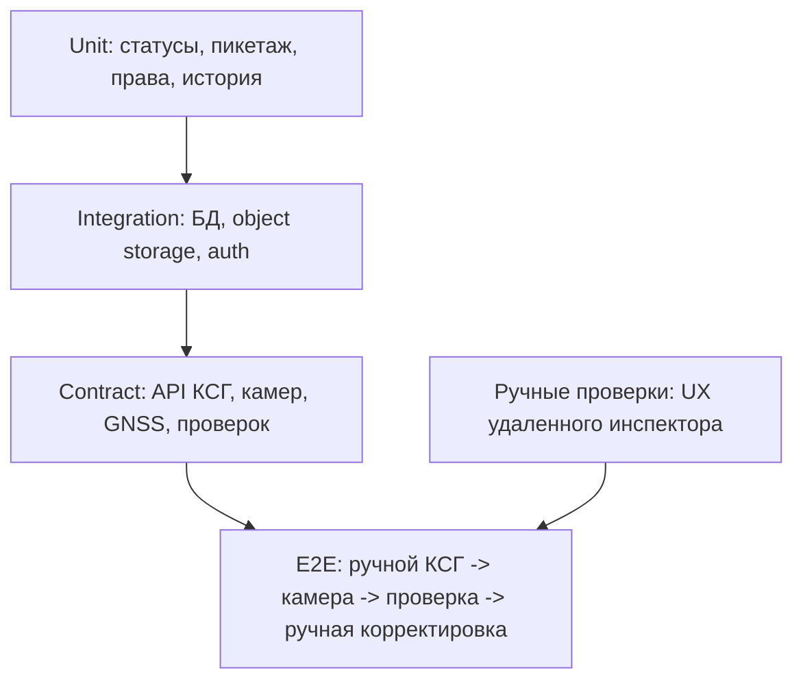

# 11. Тестирование

> Сокращения и рабочие термины расшифрованы в [словаре терминов](13-термины-и-сокращения.md).

## Стратегия

Тестирование АКСГ в MVP должно закрывать три главных риска: ошибочное ручное ведение КСГ, недоступность камер/GNSS на технике и недостоверную запись удаленного инспектора. Автоматический импорт документов и ML-проверки тестируются только после включения в будущие версии.

## Тестовая пирамида

## Матрица критичных проверок

| Проверка | Тип |
|---|---|
| Ручное создание проекта и работ КСГ | E2E |
| Ручное изменение статуса и истории КСГ | Integration + E2E |
| Привязка работы к пикетажу | Unit + UI |
| Создание техники, GNSS-модуля и камер | Integration |
| Прием координат от техники | Contract + load |
| Прием фото/видео с камеры | Contract + integration |
| Создание записи удаленной проверки | E2E |
| Ручная корректировка КСГ после проверки | E2E |
| Устройство не может менять КСГ напрямую | Security integration |
| Разграничение доступа по проектам и ролям | Security integration |
| Просмотр заказчиком КСГ и журнала контроля | UI/E2E |

## Сценарии приемки MVP

1. Планировщик создает проект и вручную заводит работы КСГ.
2. Планировщик задает пикетаж, сроки, объемы и ответственных.
3. Администратор добавляет технику, GNSS-модуль и камеры.
4. Камера передает фото/видео, а GNSS передает координаты.
5. Удаленный инспектор открывает камеру, проверяет состояние работ и создает запись проверки.
6. Планировщик или инспектор вручную меняет статус работы в КСГ.
7. Заказчик видит КСГ, запись проверки, доказательные материалы и историю изменений.
8. Пользователь без прав не может изменить КСГ или открыть чужую камеру.

## Контрактные тесты

- `Manual Schedule API`: проекты, работы, статусы, пикетаж, история изменений.
- `Remote Inspection API`: запись проверки, комментарии, связь с работой и evidence.
- `Equipment API`: техника, камеры, GNSS-точки, статус устройств.
- `Media API`: загрузка и получение фото/видео с проверкой доступа.
- `Auth API`: роли, project scope, device credentials.

## Нагрузочные проверки

- Одновременный просмотр камер несколькими инспекторами, если выбран streaming-сценарий.
- Пакетная загрузка фото/кадров с техники.
- Поток GNSS-точек от техники пилотного объекта.
- Массовое открытие КСГ и журнала контроля заказчиком/командой проекта.

## Ручные проверки

- Насколько быстро планировщик заводит типовую работу КСГ.
- Насколько понятно удаленному инспектору открыть нужную технику и камеру.
- Видно ли на экране, что КСГ меняется человеком, а не автоматически.
- Понятна ли заказчику история: проверка -> доказательство -> ручное изменение КСГ.
- Проверка терминологии и ссылок на [словарь](13-термины-и-сокращения.md).
