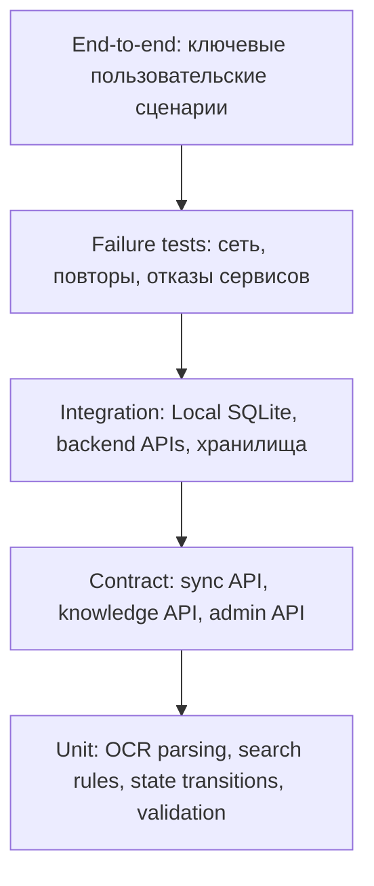

# 11. Тестирование

## Стратегия

Тестирование RMA должно проверять не только UI, но и архитектурные свойства: офлайн-работу, версионирование базы знаний, идемпотентную синхронизацию и безопасную деградацию онлайн-AI сервисов.

## Тестовая пирамида

## Матрица критичных проверок

| Область | Что проверить | Тип проверки |
|---|---|---|
| OCR | Извлечение модели и серийного номера из тестовых шильдиков | Unit / integration |
| Локальный поиск | Device -> Instruction по полной базе знаний | Unit / integration |
| Офлайн-сценарий | OCR, поиск, чек-лист, журнал без сети | E2E |
| Онлайн-RAG | Подсказка строится по опубликованной базе знаний | Integration / contract |
| Speech Service | STT/TTS доступен только онлайн, есть fallback | Integration / E2E |
| Outbox sync | Повторная отправка не создает дубликаты | Failure test |
| Версии базы знаний | Клиент применяет новую `knowledge_base_version` | Integration |
| Версия инструкции | Начатая операция сохраняет `instruction_version` | E2E |
| Права доступа | Техник не получает чужие операции и вложения | Security integration |
| Admin Panel | Публикация устройств, инструкций и чек-листов | E2E / acceptance |
| Mermaid-документация | Диаграммы рендерятся без ошибок | Static/render check |

## Сценарии приемки MVP

1. Техник без сети сканирует шильдик, находит инструкцию в локальной базе знаний, проходит чек-лист и создает `OperationLog`.
2. После появления сети Android Client синхронизирует outbox; сервер подтверждает события, повторная отправка безопасна.
3. Администратор публикует новую версию базы знаний; Android Client скачивает и применяет обновление.
4. Во время выполнения операции база знаний обновляется, но `MaintenanceJob` продолжает ссылаться на исходную `instruction_version`.
5. Search/RAG Service недоступен; приложение показывает fallback и не блокирует локальный сценарий.
6. Speech Service недоступен; техник продолжает через текстовый ввод.
7. Пользователь с ролью техника не может получить журнал или вложение другого техника.

## Контрактные тесты

| Контракт | Что проверять |
|---|---|
| Knowledge Sync API | `knowledge_base_version`, checksum, full package, incremental package |
| Operation Sync API | `client_operation_id`, `operation_event_id`, `idempotency_key`, sync ack |
| Admin API | Схема устройств, инструкций, чек-листов, публикация версии |
| Search/RAG API | Запрос с текстом проблемы, ссылки на источники, безопасный fallback |
| Speech API | Ограничения размера, формат ответа STT/TTS |

## Нагрузочные проверки

- Массовая загрузка новой `knowledge_base_version` клиентами после публикации.
- Пиковая синхронизация outbox после восстановления связи на участке.
- Рост числа RAG-запросов при наличии сети.
- Длительность локального поиска по полной базе знаний на типовом Android-устройстве.

## Ручные проверки

- Удобство сканирования шильдика при разном освещении.
- Понятность экрана деградации онлайн-функций.
- Читаемость чек-листа на смартфоне и планшете.
- Понятность статуса синхронизации для техника.
