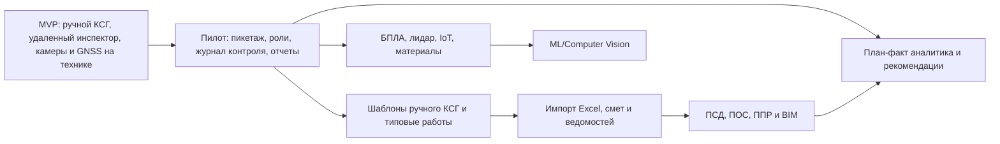

# 12. Риски и развитие

> Сокращения и рабочие термины расшифрованы в [словаре терминов](13-термины-и-сокращения.md).

## Главные риски

| Риск | Вероятность | Влияние | Митигировать |
|---|---|---|---|
| Камеры на технике дают плохой обзор | Средняя | Высокое | Прототипировать расположение камер, поддержать несколько камер на технику |
| Связь на объекте нестабильна | Высокая | Высокое | Буферизация фото/видео, индикаторы нет сигнала, fallback на выездную проверку |
| GNSS/ГЛОНАСС не доказывает выполнение работ | Высокая | Среднее | Использовать как объективный сигнал, но не как автоматический факт |
| Планировщик перегружен ручным ведением КСГ | Средняя | Высокое | Упростить UI, добавить шаблоны работ, импорт вынести в следующую версию |
| Пользователи ожидают автоматического обновления КСГ | Средняя | Среднее | Явно фиксировать границу MVP и показывать ручной статус изменений |
| Подрядчик оспаривает записи удаленного инспектора | Средняя | Высокое | Фото/видео, координаты, время, пользователь, audit trail |
| Пикетаж сложно визуализировать для многих видов работ | Средняя | Среднее | Слои работ, фильтры по этапам, не показывать все одновременно |
| Интеграции с документами и BIM затянутся | Средняя | Среднее | Не включать в MVP, начинать с ручного графика и вложений |

## Ограничения MVP

- КСГ создается и ведется вручную.
- Удаленный инспектор проверяет стройку по камерам на технике.
- GNSS/ГЛОНАСС и камеры являются источниками объективных данных, но не обновляют КСГ автоматически.
- Импорт Excel, ПСД, ПОС, ППР, смет и BIM не входит в MVP.
- ML-распознавание готовности работ не входит в MVP.
- БПЛА, лидар, RFID/GPS-материалы и глубокая 4D-BIM автоматизация являются future scope.

## Дорожная карта

## Решения для пересмотра

| Решение | Когда пересмотреть | Что смотреть |
|---|---|---|
| Ручной КСГ в MVP | Ручной ввод станет узким местом | Время создания графика, частые шаблоны, качество данных |
| Удаленный инспектор через камеры | Камеры не дают достаточного качества контроля | Расположение камер, связь, требования к фото/видео |
| GNSS/ГЛОНАСС точность около 2 м | Появятся работы, где нужна сантиметровая точность | RTK, стоимость оборудования, требования процесса |
| Нет автообновления КСГ | Появятся надежные правила подтверждения факта | Цена ошибки, ответственность, юридическая значимость |
| Импорт документов вне MVP | Ручное ведение проверено, нужно снижать трудозатраты планировщика | Форматы Excel, сметы, ПСД/ПОС/ППР, BIM API |

## Технический долг MVP

- Не выбран окончательный стек frontend/backend.
- Не выбран протокол камер: RTSP, WebRTC, периодические фото или смешанная схема.
- Не выбрана модель GNSS/ГЛОНАСС-устройств и провайдер связи.
- Не определен точный формат пикетажа и связь с координатами.
- Не согласованы юридические требования к фото/видео как доказательству.
- Не описаны детально шаблоны типовых работ КСГ.

## Открытые вопросы

- Какие камеры ставим на технику: количество, угол обзора, качество, ночной режим.
- Где хранить видео и сколько времени его держать.
- Кто именно вручную меняет КСГ после проверки: планировщик, инспектор или отдельная согласующая роль.
- Какие типы работ первыми включать в пилот: земляные, ВСП, СЦБ, контактная сеть, искусственные сооружения.
- Нужно ли учитывать требования охраны труда в первом MVP или оставить как отдельный модуль.
- Какой формат отчетов нужен заказчику: dashboard, Excel-выгрузка, PDF-акт, API.
