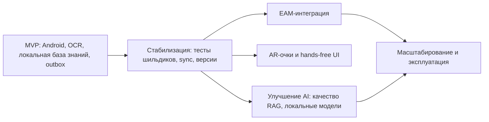

# 12. Риски и развитие

## Главные риски

| Риск | Вероятность | Влияние | Мера снижения |
|---|---|---|---|
| Полная база знаний слишком велика для устройства | Средняя | Высокое | Измерить размер, использовать инкременты, сжатие и cleanup старых версий |
| OCR ошибается на реальных шильдиках | Средняя | Высокое | Ручное подтверждение устройства, тестовый набор шильдиков, метрики точности |
| Техник работает долго без сети, outbox растет | Средняя | Среднее | Лимиты хранения, статус pending, retry policy, предупреждения |
| Search/RAG дает нерелевантную подсказку | Средняя | Высокое | Показывать источники, не заменять обязательную инструкцию, fallback на локальную базу |
| Speech Service недоступен или плохо распознает речь | Средняя | Среднее | Ручной текстовый ввод как обязательный fallback |
| Конфликт версий базы знаний | Средняя | Среднее | Фиксировать `instruction_version` в `MaintenanceJob` |
| Утечка локальной базы знаний | Низкая/средняя | Высокое | Защищенное хранилище, политики доступа, уточнение требований безопасности |
| EAM-интеграция окажется обязательной раньше плана | Средняя | Среднее | Хранить OperationLog в форме, пригодной для будущего экспорта |

## Ограничения MVP

- Поддерживаются только Android-смартфоны и Android-планшеты.
- AR-очки не поддерживаются.
- EAM-интеграция не входит в runtime MVP.
- LLM/RAG/STT/TTS работают только онлайн.
- Локальная база знаний должна быть заранее загружена и актуализирована.
- Автоматическое назначение работ и маршрутизация бригад не входят в MVP.

## Дорожная карта

## Решения для пересмотра

| Решение | Когда пересмотреть | Что смотреть |
|---|---|---|
| Полная база знаний локально | База перестает помещаться на устройстве или обновления слишком тяжелые | Размер пакета, время обновления, ошибки sync |
| OCR локально | Точность на реальных шильдиках недостаточна | Метрики OCR, число ручных исправлений |
| LLM/RAG/STT/TTS только онлайн | Появится требование полной офлайн-работы AI | Размер моделей, производительность Android-устройств |
| Backend как отдельные сервисы | Интеграционная сложность превышает выгоду | Стоимость поддержки, число инцидентов, нагрузка |
| EAM вне MVP | Заказчик требует автоматическую передачу работ | Формат OperationLog, требования EAM, SLA интеграции |

## Технический долг MVP

- Не выбран конкретный OCR SDK.
- Не определен точный формат пакета базы знаний.
- Не уточнен retention policy для локальных журналов и вложений.
- Не определена промышленная схема корпоративной аутентификации.
- Не подтвержден максимальный размер Knowledge Base на реальных данных.

## Открытые вопросы

- Какие реальные типы оборудования войдут в первый набор базы знаний.
- Какой минимальный набор шильдиков нужен для проверки OCR.
- Нужно ли разграничение инструкций по уровню квалификации техника.
- Должны ли вложения включать видео или только фото.
- Какой формат экспорта OperationLog потребуется для будущей EAM-интеграции.
